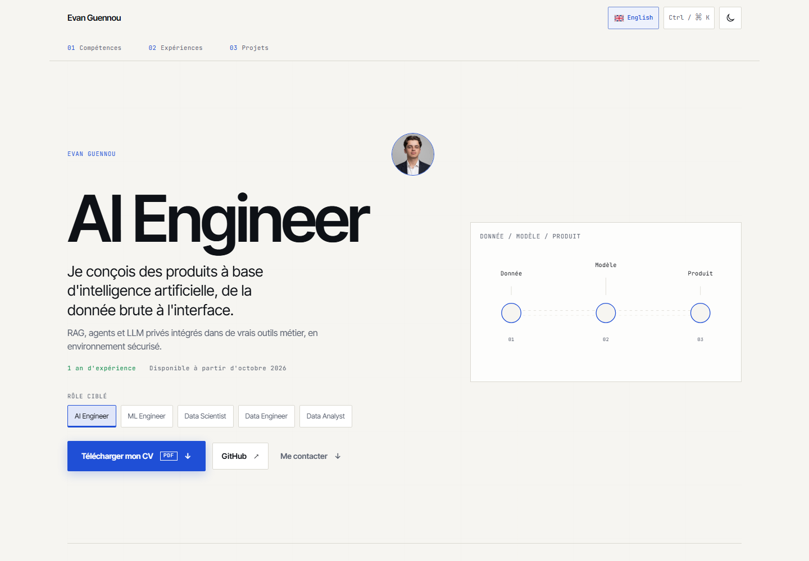
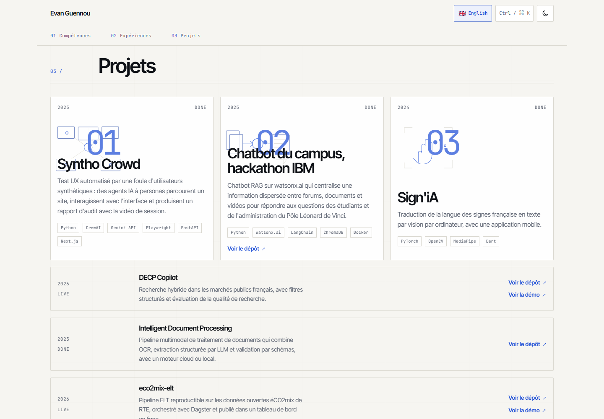
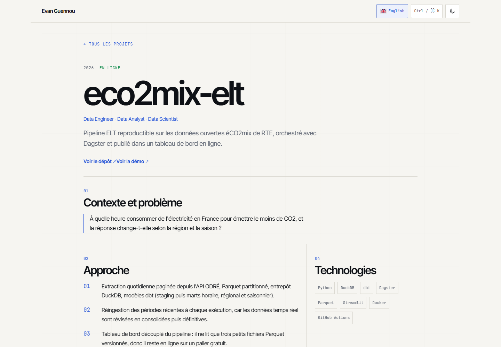

# Evan Guennou | AI Engineer

A bilingual portfolio for exploring selected AI, machine learning and data projects. It is built with Astro and presents role specific project ordering, CV downloads, detailed project pages and a keyboard accessible command palette.







## Stack

- Astro with static output
- TypeScript with strict checks
- Custom CSS with a responsive editorial blueprint design
- Inter Tight and JetBrains Mono, self hosted through Fontsource
- Sharp for build time Open Graph image generation
- GitHub Actions for checks, builds and GitHub Pages deployment

## Run locally

Use Node.js 24 and npm.

```sh
npm ci
npm run dev
```

Astro prints the local development URL in the terminal. To check and build the site:

```sh
npm run check
npm run build
npm run preview
```

The build output is written to `dist/`.

## Content and files

- `content/data.json` is the source for portfolio text in French and English.
- `public/cv/` contains the CV files served by role and language.
- `public/img/` holds optional project visuals.
- `src/pages/` contains the French and English routes, project pages and SEO endpoints.
- `src/components/` contains the reusable interface components.
- `docs/SPEC.md` records the product and design requirements.

When editing the portfolio, update `content/data.json` for visible profile and project content. Keep unavailable values marked as `TODO`; the interface hides those fields.

## GitHub Pages

The workflow in `.github/workflows/deploy.yml` runs `npm run check` and `npm run build` on pushes. It deploys the built site when a push reaches the `main` branch.

To enable publishing for a repository, open its GitHub settings, choose **Pages**, and set the build and deployment source to **GitHub Actions**. The Astro configuration reads the repository name from the Actions environment and sets the project path automatically.

## Interface

- Choose one of five target roles to adjust the highlighted skills, project order and CV link.
- Open the command palette with `Ctrl+K` or `Cmd+K` to navigate, search projects, switch role or language, change theme, copy the email, download a CV or open GitHub.
- French is the default language. English pages are available under `/en/`.
- The site supports dark and light themes, keyboard navigation and reduced motion preferences.
